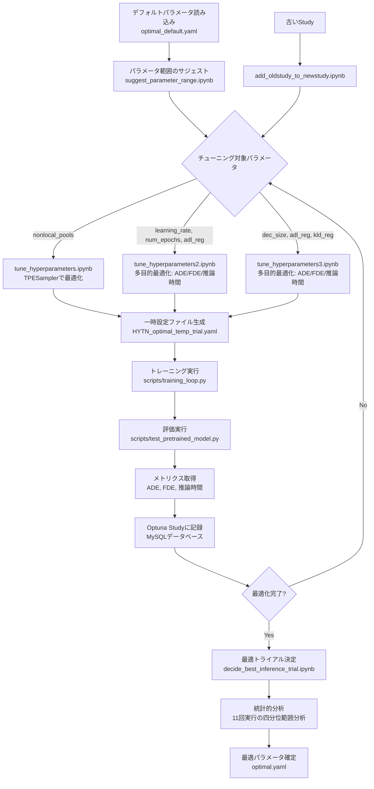

# Optuna-Practice

[Optunaドキュメント](https://optuna.readthedocs.io/en/stable/tutorial/10_key_features/001_first.html)に従って進めていきます。

OptunaドキュメントのTutorialを進める際に使用したコードは**Tutorialディレクトリ**に保存します。
実行結果はコード下部にコメントしてあります。

## クレジット

本リポジトリのPECNetとynetのコードは、[Human Path Prediction](https://github.com/HarshayuGirase/Human-Path-Prediction)リポジトリ（MIT License, Copyright (c) 2020 Harshayu Girase）を基にしています。

## ディレクトリ構成

### Tutorial

OptunaドキュメントのTutorialを進める際に使用したコードを保存しています。
各Key Featuresに対応するディレクトリにコードが整理されています。

### PECNet

[Human Path Prediction](https://github.com/HarshayuGirase/Human-Path-Prediction)リポジトリのPECNetコードを基に、一部ファイルを変更・修正したものです。

PECNetは、ECCV 2020で発表された「It is Not the Journey but the Destination: Endpoint Conditioned Trajectory Prediction」の実装です。

#### 私の貢献

PECNetのハイパーパラメータチューニングのために以下のファイルを新規作成・更新しました：

**新規作成したファイル（`utils/`ディレクトリ）:**
- `tune_hyperparameters.ipynb`: `nonlocal_pools`パラメータのチューニング
- `tune_hyperparameters2.ipynb`: `learning_rate`, `num_epochs`, `adl_reg`の多目的最適化（ADE/FDE/推論時間）
- `tune_hyperparameters3.ipynb`: `dec_size`, `adl_reg`, `kld_reg`の多目的最適化（ADE/FDE/推論時間）
- `suggest_parameter_range.ipynb`: パラメータの探索範囲をサジェストするためのコード
- `decide_best_inference_trial.ipynb`: 最適な推論トライアルを決定するためのコード（複数回実行による統計的分析）
- `add_oldstudy_to_newstudy.ipynb`: 古いOptuna studyのパラメータを新しいstudyに統合するコード

**更新したディレクトリ:**
- `config/`: チューニング結果に基づく最適な設定ファイル（`optimal.yaml`）と、チューニング用の一時設定ファイル
- `saved_models/`: チューニング過程で保存されたモデルファイル
- `scripts/`: トレーニングループとテストスクリプト

#### Optunaによるハイパーパラメータチューニングの流れ

#### チューニング結果

##### 1. nonlocal_poolsのチューニング結果

- **最適値**: `nonlocal_pools = 6`
- **ADE**: 10.0196
- **FDE**: 15.8913

##### 2. learning_rate, num_epochs, adl_regの多目的最適化結果

**推論時間が最も良いトライアル（Trial #99）:**
- `learning_rate`: 0.000879
- `num_epochs`: 267
- `adl_reg`: 1.040
- **ADE**: 10.5100
- **FDE**: 16.1274
- **推論時間**: 8.1924秒

##### 3. dec_size, adl_reg, kld_regの多目的最適化結果

**ADEが最も良いトライアル（Trial #304）:**
- `dec_size`: [186, 322, 120]
- `adl_reg`: 1.312
- `kld_reg`: 0.561
- **ADE**: 10.0567
- **FDE**: 16.2653
- **推論時間**: 8.0693秒

**FDEが最も良いトライアル（Trial #758）:**
- `dec_size`: [186, 387, 180]
- `adl_reg`: 2.030
- `kld_reg`: 1.051
- **ADE**: 10.2116
- **FDE**: 15.7514
- **推論時間**: 8.0957秒

**推論時間が最も良いトライアル（Trial #791）:**
- `dec_size`: [185, 382, 175]
- `adl_reg`: 2.478
- `kld_reg`: 1.042
- **ADE**: 10.4820
- **FDE**: 16.5770
- **推論時間**: 7.3168秒（11回実行の四分位範囲平均: 7.7809秒）

#### 推奨されるハイパーパラメータ設定

多目的最適化の結果、以下の設定が推奨されます：

**精度重視の場合:**
- `nonlocal_pools`: 6
- `dec_size`: [186, 322, 120]
- `adl_reg`: 1.312
- `kld_reg`: 0.561
- `learning_rate`: 0.000879
- `num_epochs`: 267

**推論速度重視の場合:**
- `nonlocal_pools`: 6
- `dec_size`: [185, 382, 175]
- `adl_reg`: 2.478
- `kld_reg`: 1.042
- `learning_rate`: 0.000879
- `num_epochs`: 267

**バランス型（推奨）:**
- `nonlocal_pools`: 6
- `dec_size`: [186, 387, 180]
- `adl_reg`: 2.030
- `kld_reg`: 1.051
- `learning_rate`: 0.000879
- `num_epochs`: 267

### ynet

[Human Path Prediction](https://github.com/HarshayuGirase/Human-Path-Prediction)リポジトリのynetコードをそのまま使用しています（変更・修正なし）。

ynetは、ICCV 2021で発表された「From Goals, Waypoints & Paths To Long Term Human Trajectory Forecasting」の実装です。

詳細は`ynet/README.md`を参照してください。
